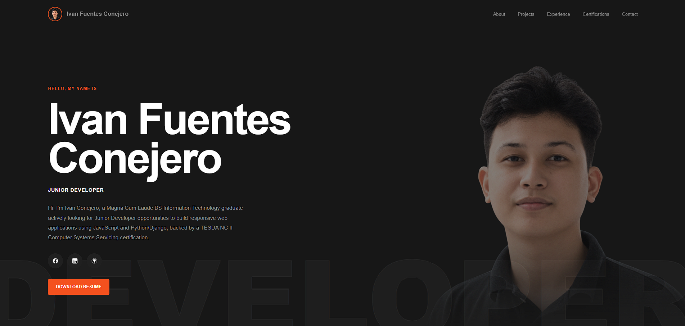

# Ivan Conejero — Web Portfolio

  

  Personal portfolio and resume website showcasing my projects, technical skills,
  education, and experience in software and web development.

  
  
  
  

---

## About

A personal web portfolio designed to present my background, technical skills,
academic experience, and software development projects in a professional format.

## Featured Projects

### University Learning Management System

A role-based LMS featuring Admin, Faculty, and Student dashboards,
activities, grading, attendance, schedules, announcements, and local data persistence.

### Other Projects

Additional academic and personal projects demonstrating my experience
with software development, web technologies, and problem solving.

## Technologies

- HTML5
- CSS3
- JavaScript
- Git
- GitHub Pages

## Portfolio Sections

- About Me
- Skills
- Education
- Projects
- Resume
- Contact

## Live Portfolio

[Visit My Portfolio](YOUR-GITHUB-PAGES-LINK)
